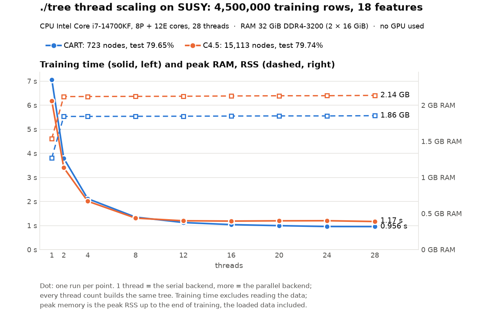

# SUSY thread scaling: ./tree with 1 to 28 threads

**Status:** run on 2026-10-10 at 19:11, one run per point, commit 49b7f47 (replacing the 2026-10-09 run on commit 93f2c03), `performance` governor. The load average at the start (8.5 / 2.9 / 1.6) is the benchmarks run just before it on this PC, which had ended; nothing else was running. `machine.json` says `-dirty` only because other benchmarks' result files were being replaced at the time; the code was committed.

## Run it

```bash
bench/results/cpu-pc-susy-scaling/run.sh          # each case once
bench/results/cpu-pc-susy-scaling/run.sh -m 5     # each case 5 times
```

- **Time:** a few minutes. 18 cases (2 protocols × 9 thread counts); on full SUSY ./tree trains in seconds, and checking the 2 GB of data at the start plus evaluating each tree in Python take longer than training.
- **Quick check on a small dataset, results elsewhere:** `run.sh -d susy_50k -o <dir>`.
- **Before:** commit the code, keep the `performance` governor, close browsers and chat apps. Scaling curves are more sensitive to background load than single-thread times: a busy core slows the whole parallel build.
- **What `run.sh` does:**
  1. Refuses to overwrite existing results.
  2. Builds `./tree_cpu` and prepares the data if it is missing.
  3. Runs the benchmark:
     `bench/run.py susy --protocols cart_alpha_nodepth,c45 --impls tree --threads 1,2,4,8,12,16,20,24,28 --cpus 2,4,6,8,10,12,14,0,16-27,3,5,7,9,11,13,15,1 --reps <-m> --timeout 3600`
  4. Writes the outputs.
- **Outputs:**

  | File | Content |
  |---|---|
  | `chart.png` | Training time (solid, left axis) and peak RSS (dashed, right axis) against threads, CART and C4.5 (`bench/scaling_chart.py`) |
  | `scaling.csv` | One row per protocol and thread count: median time, min–max, speedup, efficiency, peak RSS |
  | `report.md`, `summary.csv`, `runs.csv` | The same tables and CSVs as the other benchmarks (`bench/report.py`) |
  | `results.jsonl` | Raw rows with the exact commands |
  | `machine.json`, `plan.json` | Hardware, versions, settings, SHA-256 of every data file |
  | `run.log` | Everything `run.sh` printed |

## Method

Only ./tree runs here: this is a scaling study, not a comparison with other tools (that is `cpu-pc-susy`).

- **Protocols:** pruned CART and C4.5 with the settings of the other benchmarks, but **no depth limit for either**:
  - `cart_alpha_nodepth`: CART, cost-complexity pruning at the fixed α = 1e-5, no depth limit;
  - `c45`: C4.5, error-based pruning, CF 0.25, min 2 rows, no depth limit (the same protocol as the other benchmarks).
- **Why CART differs from the comparison benchmarks:** there, every CART tool stops at depth 30 because rpart cannot grow deeper (`rpart.control` refuses `maxdepth > 30`). Only ./tree runs here, so nothing needs the cap. As a result the CART tree here can be deeper than `cart_alpha`'s, and its 1- and 28-thread times are not the same measurement as in `cpu-pc-susy`. C4.5 is the same protocol in both, so its points are.
- **Still two algorithms:** CART and C4.5 differ in split criterion, leaf size and pruning, so the chart shows how each scales, not the same work done two ways.
- **Data:** full SUSY, published split: 4,500,000 training rows, 500,000 test rows, 18 features.
- **Thread counts:** 1, 2, 4, 8, 12, 16, 20, 24, 28.
  - 1 thread is the serial backend (`--serial`), as in the other benchmarks; more threads use `--parallel --threads N`. Speedup is the serial time divided by the N-thread time, so it includes the parallel backend's own overhead.
  - Every thread count must build the same tree (the backends are exact); `scaling_chart.py` warns if the tree size differs.
- **Measurements:** the same as every benchmark here (bench/README.md): training time timed inside ./tree (presort, build, pruning; no file reading), and peak RSS up to the end of training, from the same process. No cross-validation: each case grows one tree.

### Pinning on a hybrid CPU

The i7-14700KF has 8 performance cores with 2 hardware threads each (logical CPUs 0–15, siblings 0/1, 2/3, …) and 12 efficiency cores with one each (16–27). N threads are pinned with `taskset` to the first N CPUs of this list:

| Threads | CPUs | What is added |
|---|---|---|
| 1–8 | 2, 4, 6, 8, 10, 12, 14, 0 | one thread per P-core |
| 9–20 | 16–27 | the E-cores |
| 21–28 | 3, 5, 7, 9, 11, 13, 15, 1 | the second hardware thread of each P-core |

- **Why this order:** each step adds the fastest resource still free, so the curve shows separately what P-cores, E-cores and SMT contribute.
- **CPU 2 first:** the 1-thread case runs on CPU 2, as in the other benchmarks (CPU 0 takes most interrupts).
- **What to expect:** at most linear speedup up to 8 threads; flatter from 9 to 20, since an E-core is slower than a P-core and the slowest thread can hold up a parallel step; little from 21 to 28, since an SMT sibling shares its core with a thread already running.

## Results



| Threads | CART time | speedup | C4.5 time | speedup |
|--:|--:|--:|--:|--:|
| 1 (serial) | 7.06 s | 1.0× | 6.17 s | 1.0× |
| 2 | 3.79 s | 1.9× | 3.40 s | 1.8× |
| 4 | 2.12 s | 3.3× | 2.01 s | 3.1× |
| 8 | 1.35 s | 5.2× | 1.31 s | 4.7× |
| 12 | 1.12 s | 6.3× | 1.20 s | 5.2× |
| 16 | 1.04 s | 6.8× | 1.18 s | 5.2× |
| 20 | 0.99 s | 7.1× | 1.20 s | 5.2× |
| 24 | 0.96 s | 7.4× | 1.20 s | 5.1× |
| 28 | 0.96 s | 7.4× | 1.17 s | 5.3× |

- **Same trees:** CART 723 nodes, C4.5 15,113 nodes at every thread count (and the same as on 2026-10-09).
- **Shape:** near-linear up to 4 threads; beyond that the big nodes are bound by memory bandwidth (a STREAM-style triad reaches 36 GB/s on this PC). CART keeps gaining a little through the E-cores (1.35 s at 8 threads, 0.99 s at 20), C4.5 flattens at 12, and the SMT siblings (21–28) add almost nothing.
- **Against the first run (commit 93f2c03):** 1.23–1.44× faster at every point (CART 10.06 → 7.06 s serial, 1.20 → 0.96 s on 28 threads; C4.5 7.59 → 6.17 s and 1.52 → 1.17 s).
- **Memory:** the parallel backend keeps a second copy of the columns for the out-of-place partition, so from 2 threads on the peak RSS is a constant ~1.85 GB (CART) and ~2.13 GB (C4.5) instead of growing with the threads' buffers; the serial run needs 1.27 and 1.54 GB.
