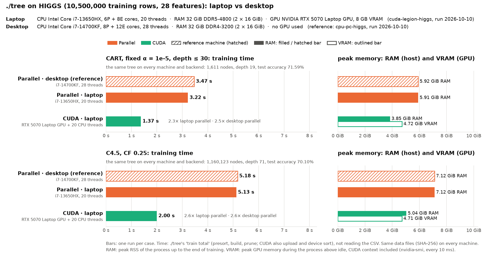

# HIGGS on the Legion laptop: ./tree parallel and CUDA

**Status:** rerun on 2026-10-10 at 19:10 on the faster code (at the same time as `cpu-pc-higgs`, on the other machine; the first runs, at 12:46 on commit abc0a22, are replaced), one run per case, commit 49b7f47, AC power, platform profile `max-power`, `performance` governor. The load average at the start (2.0) is `cuda-legion-susy`, which had just ended; nothing else was running. `machine.json` says `-dirty` only because the old result files had been deleted for the rerun; the code was committed. The 8 prepared data files have the same SHA-256 as in `cpu-pc-higgs` (`meta.json` differs only in the source's column and label names), and every case built the same tree.

The laptop half of a laptop-vs-desktop comparison on HIGGS; the desktop half is [`cpu-pc-higgs`](../cpu-pc-higgs/BENCHMARK.md). Both are fresh runs; nothing is copied.

## Run it

```bash
bench/results/cuda-legion-higgs/run.sh          # each case once
bench/results/cuda-legion-higgs/run.sh -m 5     # each case 5 times
```

- **Time:** a few minutes, plus preparing HIGGS once.
- **Before:** the same as [`cuda-legion-susy`](../cuda-legion-susy/BENCHMARK.md): commit the code, AC power, platform profile `max-power`, `performance` governor, nothing else on the GPU.
- **What `run.sh` does:** as in `cuda-legion-susy`, with
  `bench/run.py higgs --protocols cart_alpha,c45 --impls tree,tree_cuda --threads all --cpus 4,0-3,5-19 --reps <-m> --timeout 3600`
- **Chart** (`chart.png`, drawn by `run.sh`): this run with the desktop's `cpu-pc-higgs` as hatched reference, the hardware of both machines in its header, RAM and VRAM as separate bars. It refuses to draw if the data files or trees differ. Alone:
  ```bash
  bench/.venv/bin/python bench/machines_chart.py bench/results/cuda-legion-higgs \
      --reference bench/results/cpu-pc-higgs
  ```
  Run `cpu-pc-higgs` first: the chart needs it.

## Method

The protocols, data and measurements of [`cpu-pc-higgs`](../cpu-pc-higgs/BENCHMARK.md) (where the HIGGS data and its check are described), on the laptop, with two backends:

| Backend | Command | Threads |
|---|---|---|
| Parallel | `./tree_cpu --parallel --threads 20` | 20 (all) |
| CUDA | `./tree --cuda --threads 20` | GPU, plus 20 CPU threads for the small subtrees |

- **GPU memory:** ./tree keeps two copies of all sorted columns on the GPU: 10.5M rows × 28 features × 8 bytes × 2 ≈ 4.4 GiB, plus the CUDA context; the RTX 5070 Laptop GPU has 8 GB. ./tree checks the free memory before allocating and stops with an error if it does not fit.
- **Memory measured:** peak RSS up to the end of training; for CUDA also the peak GPU memory above idle (`nvidia-smi` every 10 ms).

## Results



Training time, one run per case, both machines run fresh:

| | CART | C4.5 |
|---|--:|--:|
| Desktop parallel (i7-14700KF, 28 threads) | 3.47 s | 5.18 s |
| Laptop parallel (i7-13650HX, 20 threads) | 3.22 s | 5.13 s |
| Laptop CUDA (RTX 5070 Laptop + 20 threads) | **1.37 s** | **2.00 s** |

- **Same trees:** CART 1,611 nodes, depth 19, test accuracy 71.59%; C4.5 1,160,123 nodes, depth 71, 70.10%, on both machines, both backends, and the same as in the first runs.
- **CUDA:** 2.3× (CART) and 2.6× (C4.5) faster than the laptop's 20 threads; 2.5× and 2.6× faster than the desktop's 28. About the same gain over the CPU as on SUSY (2.5× and 2.3× over the laptop's 20 threads there).
- **Fits the GPU:** 4.72 GiB of the 8 GB (CART; C4.5 4.71 GiB), CUDA context included. Host peak RSS 3.85 GiB (CART) and 5.04 GiB (C4.5), below the parallel runs.
- **Parallel:** the laptop's 20 threads and the desktop's 28 are within 7% of each other (CART 3.22 vs 3.47 s, C4.5 5.13 vs 5.18 s); repeated runs (below) put the desktop slightly ahead on CART, so one run per case does not tell these two machines apart. Both need the same memory (5.9 GiB CART, 7.1 GiB C4.5): the second copy of the columns for the out-of-place partition dominates, not per-thread buffers.
- **Against the first runs (12:46, commit abc0a22):** CUDA 2.06 → 1.37 s (CART, 1.5×) and 4.08 → 2.00 s (C4.5, 2.0×); laptop parallel 4.60 → 3.22 s and 6.65 → 5.13 s; desktop parallel 4.45 → 3.47 s and 7.29 → 5.18 s. C4.5 used to gain less from CUDA than CART (1.6× against 2.2× over the laptop's 20 threads); its tree of 1.16 million nodes gains from both the GPU changes (the exact pass scores only the cuts the float pass kept) and the CPU ones (./tree --cuda grows the small subtrees and prunes on the CPU, and C4.5 pruning is 2–2.5× faster).

### Why the laptop's 20 threads keep up with the desktop's 28

The desktop's CPU is faster (serial runs on SUSY are 6–9% faster on it), but the parallel build is largely bound by memory bandwidth, and the laptop has the faster RAM.

| Measured on 2026-10-10 | Desktop | Laptop |
|---|--:|--:|
| RAM | DDR4-3200, 2 channels (51.2 GB/s peak) | DDR5-4800, 2 channels (76.8 GB/s peak) |
| STREAM-style triad, all threads | 36 GB/s (28 threads) | 53 GB/s (20 threads) |
| Triad, 1 thread | 28.5 GB/s | 28.9 GB/s |

./tree's own phase timings on HIGGS, `--parallel`, 3 runs each on commit 49b7f47, measured after the benchmark (ms):

| | Presort | Build | Prune | Train total |
|---|--:|--:|--:|--:|
| C4.5 desktop (28 threads) | 730–755 | 3,869–3,900 | 525–582 | 5,154–5,226 |
| C4.5 laptop (20 threads) | 557–563 | 3,897–4,195 | 532–549 | 5,005–5,295 |
| CART desktop (28 threads) | 712–717 | 2,469–2,474 | 9–12 | 3,195–3,198 |
| CART laptop (20 threads) | 495–506 | 2,898–2,936 | 9–12 | 3,408–3,448 |

- **Presort** (sorting every column: streaming through memory) is 1.3–1.4× faster on the laptop in both algorithms, close to the ratio of the measured bandwidth (53 / 36).
- **Build:** CART's takes 15% less time on the desktop (more cores, higher clocks); C4.5's takes about as long on both (the laptop's three runs spread by 8%).
- **Prune** takes ~0.55 s on both (C4.5; it was 1.2–1.4 s before the pruning rework).
- **Net:** C4.5 is a tie (5.15–5.23 s vs 5.01–5.30 s). On CART the desktop's faster build outweighs the laptop's faster presort: 3.20 s vs 3.41–3.45 s, 7% in the desktop's favour, although the single benchmark run above happened to put the laptop ahead.
