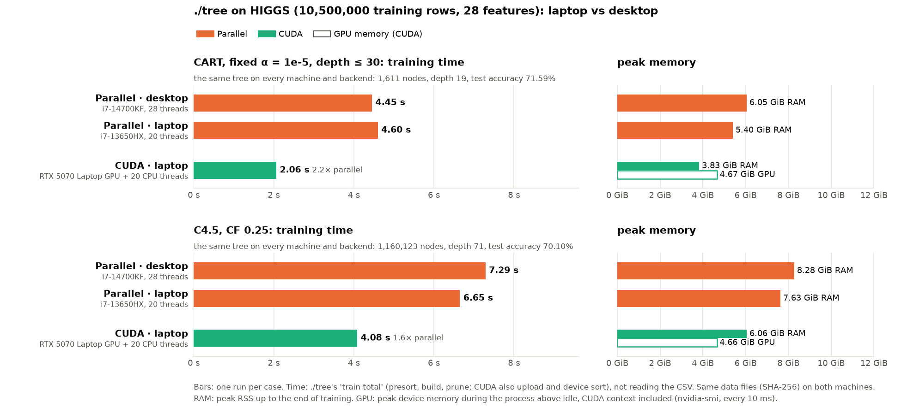

# HIGGS on the Legion laptop: ./tree parallel and CUDA

**Status:** run on 2026-10-10 at 12:46 (at the same time as `cpu-pc-higgs`, on the other machine), one run per case, commit abc0a22, AC power, platform profile `max-power`, `performance` governor, load average 0.06. The 8 prepared data files have the same SHA-256 as in `cpu-pc-higgs` (`meta.json` differs only in the source's column and label names), and every case built the same tree.

The laptop half of a laptop-vs-desktop comparison on HIGGS; the desktop half is [`cpu-pc-higgs`](../cpu-pc-higgs/BENCHMARK.md). Both are fresh runs; nothing is copied.

## Run it

```bash
bench/results/cuda-legion-higgs/run.sh          # each case once
bench/results/cuda-legion-higgs/run.sh -m 5     # each case 5 times
```

- **Time:** a few minutes, plus preparing HIGGS once.
- **Before:** the same as [`cuda-legion-susy`](../cuda-legion-susy/BENCHMARK.md): commit the code, AC power, platform profile `max-power`, `performance` governor, nothing else on the GPU.
- **What `run.sh` does:** as in `cuda-legion-susy`, with
  `bench/run.py higgs --protocols cart_alpha,c45 --impls tree,tree_cuda --threads all --cpus 4,0-3,5-19 --reps <-m> --timeout 3600`
- **Laptop vs desktop chart** (`machines.png`), once both runs are done; it refuses to draw if the data files or trees differ:
  ```bash
  bench/.venv/bin/python bench/machines_chart.py bench/results/cpu-pc-higgs \
      bench/results/cuda-legion-higgs --out bench/results/cuda-legion-higgs/machines.png
  ```

## Method

The protocols, data and measurements of [`cpu-pc-higgs`](../cpu-pc-higgs/BENCHMARK.md) (where the HIGGS data and its check are described), on the laptop, with two backends:

| Backend | Command | Threads |
|---|---|---|
| Parallel | `./tree_cpu --parallel --threads 20` | 20 (all) |
| CUDA | `./tree --cuda --threads 20` | GPU, plus 20 CPU threads for the small subtrees |

- **GPU memory:** ./tree keeps two copies of all sorted columns on the GPU: 10.5M rows × 28 features × 8 bytes × 2 ≈ 4.4 GiB, plus the CUDA context; the RTX 5070 Laptop GPU has 8 GB. ./tree checks the free memory before allocating and stops with an error if it does not fit.
- **Memory measured:** peak RSS up to the end of training; for CUDA also the peak GPU memory above idle (`nvidia-smi` every 10 ms).

## Results



Training time, one run per case, both machines run fresh:

| | CART | C4.5 |
|---|--:|--:|
| Desktop parallel (i7-14700KF, 28 threads) | 4.45 s | 7.29 s |
| Laptop parallel (i7-13650HX, 20 threads) | 4.60 s | 6.65 s |
| Laptop CUDA (RTX 5070 Laptop + 20 threads) | **2.06 s** | **4.08 s** |

- **Same trees:** CART 1,611 nodes, depth 19, test accuracy 71.59%; C4.5 1,160,123 nodes, depth 71, 70.10%, on both machines and both backends.
- **CUDA:** 2.2× (CART) and 1.6× (C4.5) faster than the laptop's 20 threads; 2.2× and 1.8× faster than the desktop's 28. About the same gain over the CPU as on SUSY (2.1× and 1.7× over the laptop's 20 threads there). C4.5 gains less than CART on both datasets; its trees are much larger (here 1.16 million nodes), and ./tree --cuda grows small subtrees on the CPU.
- **Fits the GPU:** 4.67 GiB of the 8 GB (CART; C4.5 4.66 GiB), CUDA context included. Host peak RSS 3.83 GiB (CART) and 6.06 GiB (C4.5), below the parallel runs.
- **Parallel:** the laptop's 20 threads match the desktop's 28 on CART (4.60 vs 4.45 s) and beat them on C4.5 (6.65 vs 7.29 s). The desktop also needs more memory (6.05 vs 5.40 GiB, 8.28 vs 7.63 GiB): more threads, more per-thread buffers.
