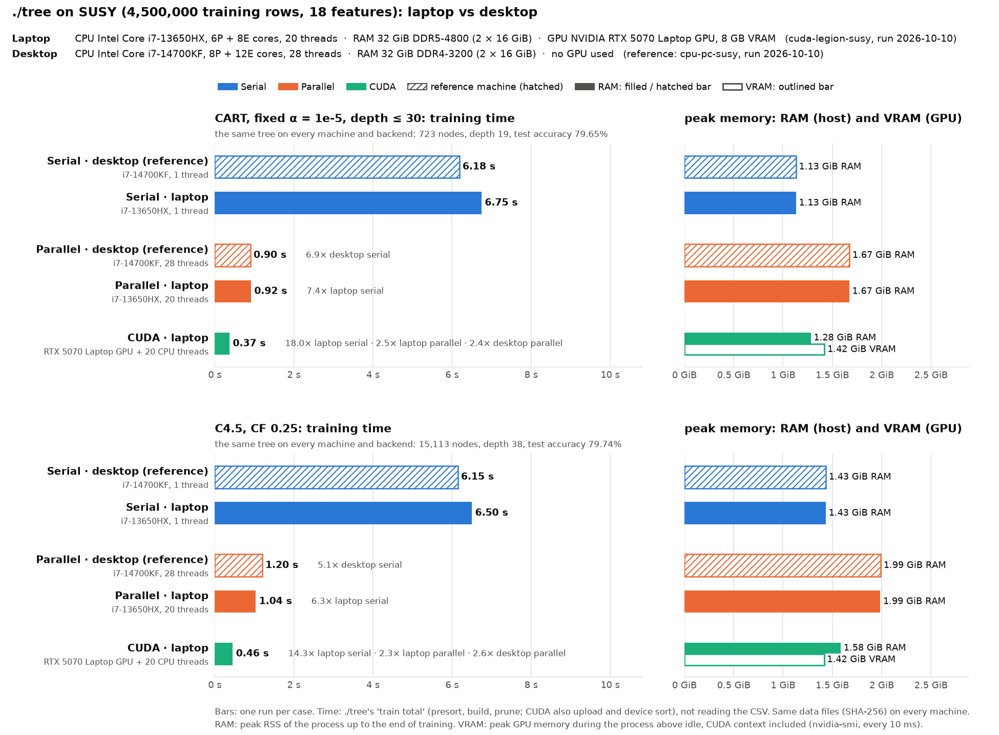

# SUSY on the Legion laptop: ./tree serial, parallel and CUDA

**Status:** rerun on 2026-10-10 at 19:09 on the faster code (the first run, at 12:38 on commit a730d4a, is replaced), one run per case, commit 49b7f47, laptop on AC, platform profile `max-power`, `performance` governor, load average 0.9 (from updating the checkout just before). `machine.json` says `-dirty` only because the old result files had been deleted for the rerun; the code was committed. The data files have the same SHA-256 as in `cpu-pc-susy` (all 9), and every case built the desktop's tree.

## Run it

```bash
bench/results/cuda-legion-susy/run.sh          # each case once
bench/results/cuda-legion-susy/run.sh -m 5     # each case 5 times
```

- **Time:** a few minutes. 6 cases (2 protocols × serial, parallel, CUDA); ./tree trains in seconds, checking the 2 GB of data at the start and evaluating each tree in Python take longer.
- **Before:**
  - commit the code (`machine.json` records the ./tree version);
  - laptop on AC power, platform profile `max-power`, CPU governor `performance` (`run.sh` warns otherwise):
    ```bash
    echo max-power | sudo tee /sys/firmware/acpi/platform_profile
    sudo cpupower frequency-set -g performance
    ```
  - nothing else on the GPU: GPU memory is sampled for the whole device;
  - close browsers and chat apps.
- **What `run.sh` does:**
  1. Refuses to overwrite existing results.
  2. Builds `./tree` (CPU + CUDA, `make tree`) and `./tree_cpu`, the memory launcher and the Python venv. Not the other tools: only ./tree runs here.
  3. Prepares full SUSY if it is missing.
  4. Runs the benchmark:
     `bench/run.py susy --protocols cart_alpha,c45 --impls tree,tree_cuda --threads 1,all --cpus 4,0-3,5-19 --reps <-m> --timeout 3600`
  5. Writes the outputs.
- **Outputs:** `report.md`, `summary.csv`, `runs.csv`, `results.jsonl`, `machine.json` (now with the GPU, nvcc and the RAM modules), `plan.json`, `run.log`, as in `cpu-pc-susy`, and `chart.png`: this run with the desktop's `cpu-pc-susy` as hatched reference, the hardware of both machines in its header, RAM and VRAM as separate bars.
- **The chart alone** (`run.sh` draws it; it refuses to draw if the data files or trees differ from the reference):
  ```bash
  bench/.venv/bin/python bench/machines_chart.py bench/results/cuda-legion-susy \
      --reference bench/results/cpu-pc-susy
  ```
- `cpu-pc-susy`'s `machine.json` got its `ram_modules` on 2026-10-10 after its run (read from udev on the same PC); `run.py` records them since.

## Method

The same protocols, data and measurements as [`cpu-pc-susy`](../cpu-pc-susy/BENCHMARK.md), for ./tree only, so its ./tree times compare with the desktop's directly.

| Backend | Command | Threads |
|---|---|---|
| Serial | `./tree_cpu --serial` | 1 (CPU 4) |
| Parallel | `./tree_cpu --parallel --threads 20` | 20 (all) |
| CUDA | `./tree --cuda --threads 20` | GPU, plus 20 CPU threads for the small subtrees |

- **Protocols:** `cart_alpha` (CART, depth ≤ 30, cost-complexity pruning at α = 1e-5) and `c45` (C4.5, CF 0.25, min 2 rows, no depth limit), identical to `cpu-pc-susy`.
- **Same tree:** the three backends are exact, so every case must build the same tree as on the desktop (CART 723 nodes, C4.5 15,113 nodes).
- **Same data:** `plan.json` records the SHA-256 of every data file; they must equal those of `cpu-pc-susy`.
- **Training time:** `train total` inside ./tree (presort, build, prune; for CUDA also the GPU setup: upload, device sort). Reading the CSV is not timed. CUDA context creation overlaps reading the CSV and is not timed either.
- **Memory:**
  - peak RSS of the process up to the end of training (host memory), as everywhere;
  - CUDA only: peak GPU memory, sampled by `nvidia-smi` every 10 ms for the whole device, minus what was in use just before the process started (so it includes the CUDA context).

### The laptop

Lenovo Legion: Intel Core i7-13650HX (6 P-cores with 2 threads each, CPUs 0–11; 8 E-cores, CPUs 12–19; 20 threads), 32 GB RAM, NVIDIA GeForce RTX 5070 Laptop GPU (8 GB), CachyOS.

The desktop of `cpu-pc-susy` (i7-14700KF, 28 threads) is not run here: its ./tree numbers (rerun there on the same commit, 2026-10-10) are drawn into the comparison chart, hatched.

## Results



Training time (one run per case); the desktop rows come from `cpu-pc-susy` (its ./tree cases were rerun on the same commit, 2026-10-10).

| | CART | C4.5 |
|---|--:|--:|
| Desktop serial (i7-14700KF, 1 thread) | 6.18 s | 6.15 s |
| Laptop serial (i7-13650HX, 1 thread) | 6.75 s | 6.50 s |
| Desktop parallel (28 threads) | 0.90 s | 1.20 s |
| Laptop parallel (20 threads) | 0.92 s | 1.04 s |
| Laptop CUDA (RTX 5070 Laptop + 20 threads) | **0.37 s** | **0.46 s** |

- **Same trees:** CART 723 nodes, depth 19, test accuracy 79.65%; C4.5 15,113 nodes, depth 38, 79.74%, on both machines, all backends, and the same as in the first run.
- **CUDA:** 18.0× (CART) and 14.3× (C4.5) faster than the laptop's serial run, 2.5× and 2.3× faster than its 20 threads, and 2.4× and 2.6× faster than the desktop's 28 threads.
- **Fits the GPU easily:** 1.42 GiB of the 8 GB, CUDA context included. Host peak RSS: 1.28 GiB (CART) and 1.58 GiB (C4.5), less than the parallel CPU runs (1.67 and 1.99 GiB).
- **Serial:** the laptop is 6–9% slower than the desktop (4.9 vs 5.6 GHz maximum boost).
- **Parallel:** the laptop's 20 threads match the desktop's 28 on CART (0.92 vs 0.90 s) and beat them on C4.5 (1.04 vs 1.20 s): the parallel build is bound by memory bandwidth, and the laptop's DDR5 is faster (see `cuda-legion-higgs`).
- **Against the first run (12:38, commit a730d4a):** CUDA 0.62 → 0.37 s (CART, 1.7×) and 0.82 → 0.46 s (C4.5, 1.8×); parallel 1.30 → 0.92 s and 1.41 → 1.04 s; serial 10.15 → 6.75 s and 8.45 → 6.50 s.
