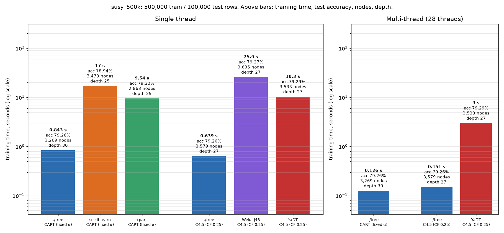

# Quick benchmark: ./tree vs scikit-learn, rpart, Weka J48 and YaDT on SUSY (500k rows)

Run on 2026-10-08 on an Intel i7-14700KF (8 performance cores + 12 efficiency cores, 28 threads, 32 GB RAM, Arch Linux). The full hardware and version details are in `machine.json`.



## Setup

- **Data:** the first 500,000 rows of SUSY's training part. Test accuracy is measured on the first 100,000 rows of the published 500k test set (the `susy_500k` entry in `bench/datasets.toml`).
- **Runs:** one timed run per case (`--reps 1`). An untimed "check" run before it records tree size and test accuracy. No memory measurement.
- **No cross-validation.** Every case grows one tree.
- **No forced tree size.** Every tool gets the same settings and reports the tree it builds.
- **Thread pinning:** a single thread runs on CPU 0 (a performance core); multi-thread runs use CPUs 0-27.
- **What is timed:** training only, not CSV or data loading.
  - `./tree`: presort, build and prune.
  - YaDT: indexing, build and prune.
  - J48: timed after one untimed warm-up fit (JIT).
  - scikit-learn and rpart: timed after a warm-up fit on 2,000 rows.
- **CART** (protocol `cart_alpha`): Gini splits, depth ≤ 30, pruned at α = 1e-5, the same number for every tool.
  - `./tree --alpha 1e-05`, scikit-learn `ccp_alpha=1e-05`, rpart `prune(cp = α·n / root risk)`.
  - scikit-learn measures α in Gini impurity rather than misclassified rows, so its tree comes out at a somewhat different size.
- **C4.5** (protocol `c45`): error-based pruning with CF 0.25 and subtree raising, at least 2 rows per leaf.
  - `./tree --c45`, J48 `-C 0.25 -M 2`, YaDT `-ebpg -c 0.25 -m 2`.

Command:

```bash
bench/.venv/bin/python bench/run.py susy_500k --protocols cart_alpha,c45 --threads 1,all --cpus 0-27 --reps 1 --skip memory,baseline
```

## Single thread

The "./tree is faster" column is the other tool's time divided by `./tree`'s time.

| Algorithm | Implementation | Train time | ./tree is faster | Test accuracy | Nodes | Leaves | Depth |
|---|---|--:|--:|--:|--:|--:|--:|
| CART | **./tree** (`--serial`) | **0.843 s** | | 79.26% | 3,269 | 1,635 | 30 |
| CART | scikit-learn 1.9.1 | 17.04 s | 20.2× | 78.94% | 3,473 | 1,737 | 25 |
| CART | rpart 4.1.27 (R 4.6.1) | 9.54 s | 11.3× | 79.32% | 2,863 | 1,432 | 29 |
| C4.5 | **./tree** (`--serial`) | **0.639 s** | | 79.26% | 3,579 | 1,790 | 27 |
| C4.5 | Weka J48 3.8.7 | 25.87 s | 40.5× | 79.27% | 3,635 | 1,818 | 27 |
| C4.5 | YaDT 2.3.0 (`-tt 1`) | 10.31 s | 16.1× | 79.29% | 3,533 | 1,767 | 27 |

## Multi-thread (28 threads)

| Algorithm | Implementation | Train time | ./tree is faster | Test accuracy | Nodes | Leaves | Depth |
|---|---|--:|--:|--:|--:|--:|--:|
| CART | **./tree** (`--parallel`) | **0.126 s** | | 79.26% | 3,269 | 1,635 | 30 |
| C4.5 | **./tree** (`--parallel`) | **0.151 s** | | 79.26% | 3,579 | 1,790 | 27 |
| C4.5 | YaDT 2.3.0 (`-tt 28`) | 3.00 s | 19.8× | 79.29% | 3,533 | 1,767 | 27 |

scikit-learn, rpart and J48 build a tree on one thread only, so none of the reference CART tools has a multi-thread case.

## Notes

- **One run per case.** These are single measurements, not medians.
- **Output files:** raw rows are in `results.jsonl`, the harness report in `report.md` and `summary.csv`, and the chart in `chart.png` (made by `bench/chart.py`).
