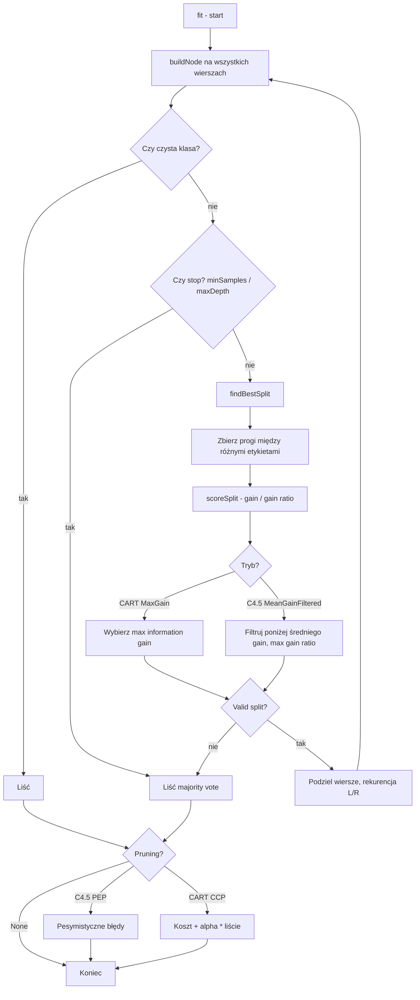

# Jak działa budowa drzewa decyzyjnego w tym projekcie

Projekt implementuje **jedno drzewo decyzyjne** (`C45Tree`), które można skonfigurować na dwa sposoby: **C4.5** albo **CART**. Nie są to dwa osobne programy — to **te same funkcje budowy**, ale z innymi opcjami w `TrainingOptions`.

---

## 1. Ogólna idea (wspólna dla obu metod)

Drzewo decyzyjne to seria pytań typu „tak/nie”, które prowadzą do odpowiedzi (klasy).

Przykład:
```
Czy PetalLength <= 2.45?
  tak  → Iris-setosa
  nie  → Czy PetalWidth <= 1.75?
           tak  → Iris-versicolor
           nie  → Iris-virginica
```

**Trening** (`fit`) ma dwie fazy:
1. **Wzrost drzewa** — rekurencyjnie dzielimy dane na coraz mniejsze grupy.
2. **Przycinanie (pruning)** — opcjonalnie usuwamy gałęzie, które nie pomagają.

**Predykcja** (`predict`) to po prostu schodzenie drzewem od korzenia do liścia.

---

## 2. Struktura danych w kodzie

| Element | Rola |
|---------|------|
| `Sample` | Jedna obserwacja: wektor liczb (`features`) + etykieta (`label`) |
| `Dataset` | Wszystkie wiersze + nazwy kolumn |
| `Node` | Węzeł drzewa — albo pytanie, albo liść z odpowiedzią |
| `TrainingOptions` | Przełączniki C4.5 vs CART |

Węzeł decyzyjny zawsze zadaje **jedno pytanie numeryczne**:

```19:21:node.h
    // The numeric question asked by this node:
    // "Is sample.features[featureIndex] <= threshold?"
    double threshold;
```

Lewe dziecko = „tak” (wartość ≤ próg), prawe = „nie” (wartość > próg).

---

## 3. Cały proces treningu — krok po kroku

### Faza 1: `fit()` uruchamia budowę

```213:260:c45_tree.cpp
void C45Tree::fit(const Dataset &dataset, const TrainingOptions &options)
{
	// ...
	root_ = buildNode(rowIndices, 0);
	// ...
	if (options_.pruningMode != PruningMode::None)
	{
		applySelectedPruning(rowIndices);
	}
}
```

Na początku **wszystkie wiersze** (0, 1, 2, …, n−1) trafiają do korzenia. Potem rekurencyjnie budujemy drzewo, a na końcu (opcjonalnie) je przycinamy.

### Faza 2: `buildNode()` — serce algorytmu

```796:844:c45_tree.cpp
C45Tree::buildNode(const std::vector<std::size_t> &rowIndices, int depth) const
{
	// Jeśli wszystkie wiersze mają tę samą klasę → liść
	if (allSameLabel(rowIndices))
		return Node::createLeaf(...);

	// Jeśli za mało danych / za głęboko → liść z klasą większościową
	if (shouldStopGrowing(rowIndices, depth))
		return Node::createLeaf(getMajorityLabel(...), ...);

	// Szukamy najlepszego podziału
	const SplitResult split = findBestSplit(rowIndices);
	if (!split.valid)
		return Node::createLeaf(getMajorityLabel(...), ...);

	// Dzielimy dane i budujemy lewe/prawe poddrzewo
	node->leftChild = buildNode(partitions.leftRows, depth + 1);
	node->rightChild = buildNode(partitions.rightRows, depth + 1);
}
```

**Warunki zatrzymania wzrostu** (`shouldStopGrowing`):
- wszystkie próbki mają tę samą etykietę,
- za mało próbek (`minSamplesToSplit`, domyślnie 2),
- osiągnięto `maxDepth` (jeśli ustawiony).

Jeśli nie da się sensownie podzielić → tworzymy **liść z klasą większościową** (najczęstsza etykieta w tej grupie).

---

## 4. Jak wybierany jest najlepszy podział (`findBestSplit`)

To jest wspólne dla C4.5 i CART — różni się tylko **ocena** i **wybór zwycięzcy**.

### Krok A: Kandydaci na progi

Dla każdej cechy numerycznej:
1. Sortujemy wartości cechy w bieżącym węźle.
2. Szukamy miejsc, gdzie **obok siebie są różne etykiety**.
3. Progiem jest **średnia** dwóch sąsiednich wartości.

```508:527:c45_tree.cpp
	for (std::size_t index = 1; index < values.size(); ++index)
	{
		// ...
		if (leftLabel == rightLabel)
			continue;

		thresholds.push_back((leftValue + rightValue) / 2.0);
	}
```

To optymalizacja z C4.5: nie trzeba testować wszystkich możliwych progów — wystarczą progi między punktami, gdzie zmienia się klasa.

### Krok B: Ocena każdego kandydata (`scoreSplit`)

Dla każdej pary (cecha, próg):
1. Dzielimy wiersze na lewą i prawą grupę.
2. Liczymy **nieczystość (impurity)** przed i po podziale.
3. Liczymy **zysk informacji (information gain)**.

---

## 5. Teoria: miary nieczystości

### Entropia (C4.5)

Mówi, jak **zmieszane** są klasy w grupie:

\[
H(S) = -\sum_i p_i \log_2(p_i)
\]

- Wszystkie próbki tej samej klasy → entropia = **0** (czysto).
- Równy mix klas → entropia **maksymalna**.

```327:358:c45_tree.cpp
double C45Tree::entropy(...) const
{
	// H(S) = -sum(p * log2(p))
	for (const auto &entry : counts)
	{
		const double probability = ...;
		result -= probability * std::log2(probability);
	}
}
```

### Indeks Giniego (CART)

Inna miara nieczystości:

\[
Gini(S) = 1 - \sum_i p_i^2
\]

- Też 0 gdy grupa jest czysta.
- CART domyślnie używa Giniego — szybszy do liczenia, często daje podobne drzewa.

```361:391:c45_tree.cpp
double C45Tree::giniIndex(...) const
{
	// Gini(S) = 1 - sum(p^2)
	return 1.0 - sumOfSquaredProbabilities;
}
```

Funkcja `impurity()` wybiera miarę według opcji:

```394:404:c45_tree.cpp
	if (options_.impurityMeasure == ImpurityMeasure::Gini)
		return giniIndex(rowIndices);
	return entropy(rowIndices);
```

### Zysk informacji (information gain)

Wspólna formuła dla obu metod:

\[
IG = Impurity(przed) - \sum_j \frac{|S_j|}{|S|} \cdot Impurity(S_j)
\]

Im większy zysk, tym lepszy podział — dzieci są „czystsze” niż rodzic.

```406:435:c45_tree.cpp
double C45Tree::informationGain(...) const
{
	const double beforeSplit = impurity(rowIndices);
	// ...
	afterSplit += weight * impurity(part);
	return beforeSplit - afterSplit;
}
```

---

## 6. Różnice między C4.5 a CART

Konfiguracja w `main.cpp`:

```50:63:main.cpp
    // --- CART Configuration ---
    options.impurityMeasure = ImpurityMeasure::Gini;
    options.splitSelectionMode = SplitSelectionMode::MaxGain;
    options.pruningMode = PruningMode::CostComplexity;

    // --- C.45 Configuration ---
    // options.impurityMeasure = ImpurityMeasure::Entropy;
    // options.splitSelectionMode = SplitSelectionMode::MeanGainFiltered;
    // options.pruningMode = PruningMode::PessimisticError;
```

| Aspekt | C4.5 | CART |
|--------|------|------|
| Nieczystość | Entropia | Gini |
| Wybór podziału | Gain ratio + filtr średniego zysku | Maksymalizacja zysku (Gini/entropy gain) |
| Przycinanie | Pessimistic Error Pruning | Cost-Complexity Pruning |

---

## 7. C4.5 — teoria i implementacja wyboru podziału

### Problem czystego zysku informacji

Cecha z wieloma unikalnymi wartościami (np. ID) może dawać ogromny zysk, bo każda wartość tworzy małą, czystą grupę — to **overfitting**.

C4.5 wprowadza **gain ratio**:

\[
GainRatio = \frac{Information\ Gain}{Split\ Information}
\]

**Split Information** to entropia *rozmiarów* grup potomnych (nie klas):

\[
SplitInfo = -\sum_j \frac{|S_j|}{|S|} \log_2 \frac{|S_j|}{|S|}
\]

Kara za podziały bardzo nierównomierne (np. 99% w lewo, 1% w prawo).

```438:460:c45_tree.cpp
double C45Tree::splitInformation(...) const
{
	// entropia rozmiarów grup potomnych
	result -= probability * std::log2(probability);
}
```

### Dwa etapy wyboru w C4.5

**Etap 1** — dla każdej cechy wybierz najlepszy próg (najwyższy gain ratio).

**Etap 2** — `chooseBestSplit` z filtrem średniego zysku:

```614:636:c45_tree.cpp
	// C4.5: ignore features whose gain is below average
	const double averageGain = gainSum / candidates.size();
	for (const SplitResult &candidate : candidates)
	{
		if (candidate.informationGain + epsilon < averageGain)
			continue;  // odrzuć słabe cechy
		// wybierz najwyższy gain ratio
	}
```

Cechy ze zyskiem **poniżej średniej** są odrzucane — kolejna ochrona przed overfittingiem.

Przy remisach kolejność: gain ratio → information gain → wcześniejsza kolumna → niższy próg.

---

## 8. CART — teoria i implementacja wyboru podziału

CART jest prostszy: **wybierz podział z największym zyskiem** (Gini gain, bo używa Giniego).

```567:573:c45_tree.cpp
	if (options_.splitSelectionMode == SplitSelectionMode::MaxGain)
	{
		// CART only cares about impurity drop
		result.valid = (result.informationGain > options_.epsilon);
		return result;
	}
```

Gain ratio i split information **nie są liczone**.

W `chooseBestSplit`:

```600:611:c45_tree.cpp
	// CART: pick the feature winner with highest information gain
	if (options_.splitSelectionMode == SplitSelectionMode::MaxGain)
	{
		// porównaj informationGain między cechami
	}
```

Brak filtra średniego zysku — czysta maksymalizacja.

---

## 9. Przycinanie drzewa (druga faza)

Po wzroście drzewo jest często za duże. Przycinanie zastępuje poddrzewo **jednym liściem** z klasą większościową, jeśli to się opłaca.

### C4.5: Pessimistic Error Pruning (PEP)

**Idea:** Nie ufamy idealnie niskim błędom na małych liściach. Szacujemy **pesymistyczny górny bound** błędu (Wilson score / normal approximation).

Dla każdego węzła wewnętrznego (od dołu w górę):
1. Policz błędy, gdyby węzeł był liściem (majority vote).
2. Oszacuj pesymistyczny błąd tego liścia.
3. Oszacuj sumę pesymistycznych błędów wszystkich liści w poddrzewie.
4. Jeśli liść ≤ poddrzewo → **przytnij** (zastąp liściem).

```173:176:pruning/c45_prune_c45_pessimistic.cpp
    if (estimatedLeafErrors <= estimatedSubtreeErrors + options_.epsilon)
    {
        node = Node::createLeaf(majorityLabel, rowIndices.size());
    }
```

Parametr `pruningConfidenceFactor` (domyślnie 0.03) kontroluje agresywność — mniejsza wartość = mocniejsze przycinanie.

### CART: Cost-Complexity Pruning (CCP)

**Idea:** Minimalizujemy **koszt**:

\[
Cost(T) = Błędy(T) + \alpha \cdot LiczbaLiści(T)
\]

- `Błędy(T)` — ile próbek źle sklasyfikowanych.
- `α` (`ccpAlpha`) — kara za każdy dodatkowy liść.

Dla każdego węzła (bottom-up):

```38:46:pruning/cart_prune_cost_complexity.cpp
    const double costAsLeaf = errorsAsLeaf + options_.ccpAlpha;
    const double costAsSubtree = errorsInSubtree + options_.ccpAlpha * leavesInSubtree;

    if (costAsLeaf <= costAsSubtree + options_.epsilon)
        node = Node::createLeaf(majorityLabel, ...);
```

Większe `ccpAlpha` → mniejsze drzewo (silniejsza kara za złożoność).

---

## 10. Predykcja

```265:290:c45_tree.cpp
std::string C45Tree::predict(const Sample &sample) const
{
	const Node *current = root_.get();
	while (!current->isLeaf)
	{
		const double value = sample.features[current->featureIndex];
		if (value <= current->threshold)
			current = current->leftChild.get();
		else
			current = current->rightChild.get();
	}
	return current->leafLabel;
}
```

Schodzimy drzewem od korzenia. Na każdym węźle sprawdzamy jedną cechę. W liściu zwracamy zapisaną etykietę.

---

## 11. Diagram przepływu



---

## 12. Podsumowanie w jednym zdaniu

**Wspólne:** Rekurencyjnie dzielimy dane pytaniem „cecha ≤ próg?”, szukając podziału, który najbardziej „oczyszcza” grupy.

**C4.5:** Entropia + gain ratio + filtr średniego zysku + pesymistyczne przycinanie — bardziej ostrożny wobec overfittingu.

**CART:** Gini + maksymalizacja zysku + przycinanie koszt-złożoność — prostszy wybór podziału, kontrola rozmiaru przez parametr α.

Oba algorytmy w tym projekcie dzielą **~90% kodu** (`buildNode`, `findBestSplit`, `partitionRows`); różnią się głównie przez trzy enumy w `TrainingOptions`: `impurityMeasure`, `splitSelectionMode` i `pruningMode`.


# Wielowątkowość w tym projekcie

Wielowątkowość dotyczy **tylko jednej rzeczy**: oceny kandydatów na podział w `findBestSplit()`. Reszta treningu (budowa drzewa, przycinanie, predykcja) działa **jednowątkowo**.

---

## Co jest równoległe, a co nie

| Etap | Wielowątkowość |
|------|----------------|
| `buildNode()` — rekurencyjna budowa drzewa | Nie |
| `collectNumericThresholdCandidates()` — lista progów | Nie |
| **`scoreSplit()` dla każdego kandydata** | **Tak** (warunkowo) |
| `reduceBestPerFeature()` / `chooseBestSplit()` — wybór zwycięzcy | Nie |
| Przycinanie (`prunePessimisticError`, `pruneCostComplexity`) | Nie |
| `predict()` | Nie |

W praktyce: przy każdym węźle wewnętrznym, gdy algorytm szuka najlepszego podziału, **osobne wątki liczą zysk (gain) dla różnych par (cecha, próg)**. Samo „schodzenie” drzewem i tworzenie węzłów pozostaje sekwencyjne.

---

## Kiedy w ogóle włącza się wielowątkowość

Trzy warunki muszą być spełnione naraz:

1. **`maxThreadCount > 1`** — w `main.cpp` masz np. `28`.
2. **Pool wątków istnieje** — tworzony na początku `fit()`, niszczony na końcu.
3. **Wystarczająco dużo kandydatów** — domyślnie `minCandidatesToParallelize = 32`.

```657:662:c45_tree.cpp
bool C45Tree::shouldParallelizeSplitSearch(std::size_t candidateCount) const
{
	// On tiny nodes there may be only a few thresholds to try — threading costs more than it saves.
	return splitThreadPool_ != nullptr &&
		   candidateCount >= options_.minCandidatesToParallelize;
}
```

Przy małych węzłach (np. 5 progów do sprawdzenia) kod celowo zostaje jednowątkowy — koszt synchronizacji byłby większy niż zysk.

Liczba wątków jest ograniczona do liczby rdzeni:

```639:654:c45_tree.cpp
int C45Tree::effectiveSplitThreadCount() const
{
	if (options_.maxThreadCount <= 1)
		return 1;

	int threadCount = options_.maxThreadCount;
	const unsigned hardwareThreads = std::thread::hardware_concurrency();
	if (hardwareThreads > 0 && threadCount > static_cast<int>(hardwareThreads))
		threadCount = static_cast<int>(hardwareThreads);

	return threadCount;
}
```

---

## Cykl życia puli wątków

Pool żyje **tylko przez jedno wywołanie `fit()`**:

```225:232:c45_tree.cpp
	splitThreadPool_.reset();
	if (options_.maxThreadCount > 1)
	{
		splitThreadPool_ = std::make_unique<SplitThreadPool>(
			static_cast<std::size_t>(effectiveSplitThreadCount()));
	}
```

Na końcu treningu pool jest zwalniany:

```262:262:c45_tree.cpp
	splitThreadPool_.reset();
```

Nie tworzy się nowych wątków OS przy każdym węźle drzewa — to byłoby bardzo wolne. Zamiast tego **N wątków startuje raz** i obsługuje wiele zadań z kolejki.

---

## Co dokładnie robi każdy wątek

W `findBestSplit()`:

1. **Jeden wątek główny** buduje listę kandydatów `(featureIndex, threshold)` — sekwencyjnie, dla wszystkich cech.
2. Alokowany jest wektor `scoredCandidates` — po jednym wyniku na kandydata.
3. Każdy kandydat to **niezależne zadanie**: `scoreSplit()` dla danej cechy i progu.

```744:765:c45_tree.cpp
	std::vector<SplitResult> scoredCandidates(candidates.size());
	const auto evaluateCandidate = [&](std::size_t candidateIndex) {
		const SplitCandidateSpec &candidate = candidates[candidateIndex];
		scoredCandidates[candidateIndex] =
			scoreSplit(rowIndices, candidate.featureIndex, candidate.threshold);
	};

	if (shouldParallelizeSplitSearch(candidates.size()))
	{
		splitThreadPool_->parallel_for(candidates.size(), evaluateCandidate);
	}
	else
	{
		for (std::size_t candidateIndex = 0; candidateIndex < candidates.size(); ++candidateIndex)
			evaluateCandidate(candidateIndex);
	}
```

**`scoreSplit()`** w wątku roboczym:
- dzieli wiersze na lewą/prawą grupę (`partitionRows`),
- liczy entropię/Gini i information gain (ew. gain ratio dla C4.5),
- zapisuje wynik w `scoredCandidates[candidateIndex]`.

Każdy wątek pisze w **inny indeks** wektora — brak współdzielonej zmiennej do aktualizacji, więc nie ma wyścigu o ten wynik.

4. **Po zakończeniu `parallel_for`** główny wątek robi resztę sekwencyjnie: `reduceBestPerFeature()` → `chooseBestSplit()`.

---

## Jak działa `SplitThreadPool`

To prosta pula z kolejką zadań i wspólnym licznikiem indeksów:

```119:168:c45_tree.cpp
	void parallel_for(std::size_t count, const std::function<void(std::size_t)> &work)
	{
		std::atomic<std::size_t> nextIndex{0};
		// ...
		for (std::size_t workerIndex = 0; workerIndex < workersToUse; ++workerIndex)
		{
			enqueue([&]() {
				while (true)
				{
					const std::size_t index = nextIndex.fetch_add(1, ...);
					if (index >= count) break;
					work(index);
				}
				// ostatni worker budzi czekający wątek główny
			});
		}
		doneCv_.wait(...);  // fit() czeka aż wszyscy skończą
	}
```

Schemat:

```
Wątek główny (buildNode → findBestSplit)
    │
    ├─ zbiera kandydatów [0..N-1]
    │
    ├─ parallel_for(N, evaluateCandidate)
    │       Worker 1: index 0, 4, 8, ...
    │       Worker 2: index 1, 5, 9, ...
    │       Worker 3: index 2, 6, 10, ...
    │       ...
    │       (atomic nextIndex — dynamiczny podział pracy)
    │
    └─ reduceBestPerFeature + chooseBestSplit (jeden wątek)
```

**Work stealing przez atomowy licznik:** wątek bierze kolejny wolny indeks, aż skończą się kandydaci. Nie ma sztywnego „wątek 0 robi 0–99, wątek 1 robi 100–199”.

---

## Dlaczego reszta jest jednowątkowa

**Budowa drzewa (`buildNode`)** — rekurencja zależna: lewe poddrzewo buduje się po wyborze podziału w węźle. Trudno sensownie równoleglić gałęzie bez duplikowania danych i skomplikowanej synchronizacji.

**Przycinanie** — przejście bottom-up po drzewie; każdy krok zależy od dzieci. W kodzie nie ma tu wątków.

**Predykcja** — jedna próbka, jedna ścieżka; równoległość nie ma sensu.

---

## Determinizm (ważne przy debugowaniu)

Przy remisach wyników używane są **stałe reguły tie-break** (gain ratio, wcześniejsza kolumna, niższy próg), żeby drzewo było takie samo w wersji równoległej i sekwencyjnej:

```30:31:c45_tree.cpp
	// tree is always the same (important for debugging and for parallel vs serial).
```

Kolejność **obliczania** kandydatów może być inna między wątkami, ale końcowy wybór zależy tylko od wartości liczbowych i ustalonych tie-breakerów — nie od tego, który wątek skończy pierwszy.

---

## Podsumowanie

Wielowątkowość to **równoległe liczenie ocen podziałów** w `findBestSplit()`: wiele wątków naraz wywołuje `scoreSplit()` dla różnych `(cecha, próg)` w tym samym węźle. Pool tworzy się na czas `fit()`, włącza się tylko przy ≥32 kandydatach, a wyniki składane są w jednym wątku przed wyborem najlepszego podziału. Reszta algorytmu — w tym sama rekurencja budowy drzewa — działa sekwencyjnie.
